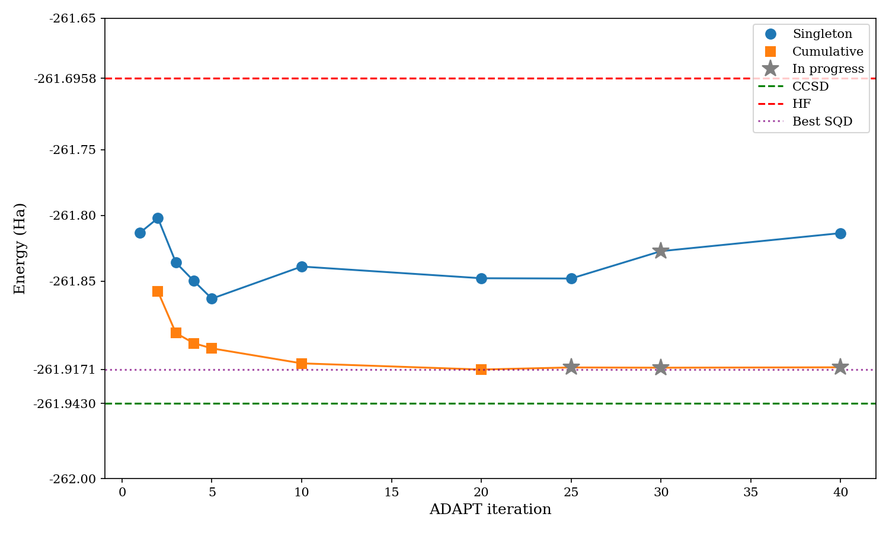
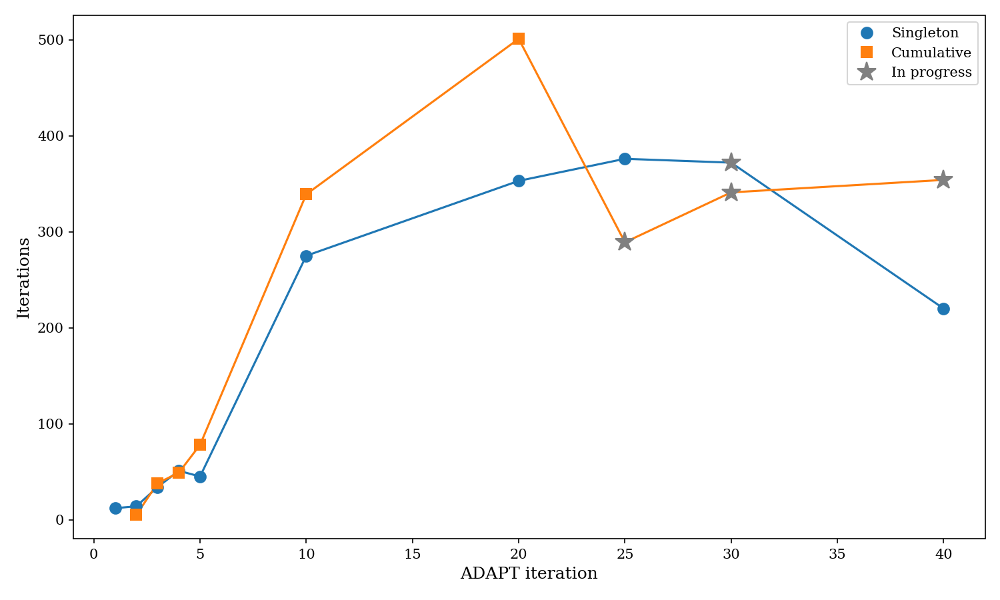

# SQD + SBD (GPU) for ATP Fragment

GPU-accelerated [Sample-based Quantum Diagonalization (SQD)](https://arxiv.org/abs/2405.05068) using [SBD](https://github.com/r-ccs-cms/sbd) (Selected Basis Diagonalization) as the CI solver, replacing PySCF's CPU-based Selected CI.

Applied to the ATP fragment `atp_0_be2_f4` (32 orbitals, 32 electrons) using 100k-shot measurements from IBM Boston.

## Directory structure

```
sqd_sbd/
├── run_sqd_sbd.py          # SQD loop (symmetrized spin)
├── submit_sqd_sbd.sh       # SLURM submission script
├── plot_results.py          # Singleton vs cumulative (sym only)
├── plot_comparison.py       # 4-trendline sym vs nosym comparison
├── plot_determinants.py     # Determinant count comparison
├── results.md               # Summary tables for all runs
├── results/                 # Sym energy convergence files
├── plots/                   # Generated PNGs
└── nosym/                   # No-symmetrization variant
    ├── README.md            # Explains approach and nosplit infeasibility
    ├── run_sqd_nosym.py     # Nosym SQD loop
    ├── submit_sqd_nosym.sh  # SLURM submission
    └── results/             # Nosym energy convergence files
```

## Requirements

**SBD solver** (external, not included — see [jdrowland/sbd](https://github.com/jdrowland/sbd)):
- NVHPC compiler with CUDA support (tested with NVHPC 23.7, CUDA 12.1)
- MPI (OpenMPI)
- LAPACK/BLAS (FlexiBLAS or OpenBLAS)
- NVIDIA GPU (A100 or H200)

**Python environment:**
- numpy
- pyscf
- qiskit-addon-sqd
- matplotlib

## Building SBD

Follow the instructions in the [SBD repository](https://github.com/jdrowland/sbd). On MSU ICER:

```bash
module load NVHPC/23.7-CUDA-12.1.1
module load OpenMPI/4.1.5-NVHPC-23.7-CUDA-12.1.1
module load FlexiBLAS/3.3.1-NVHPC-23.7-CUDA-12.1.1

cd sbd/apps/chemistry_tpb_selected_basis_diagonalization
# Edit Configuration: set -gpu=cc80 (A100) or -gpu=cc90 (H200)
make
```

This produces the `diag` executable.

## Running

Scripts use relative paths to reference data already in this repository (circuits, hamiltonians, and measurement results in `../circuits`, `../hamiltonians`, `../results`). The only external dependency is the SBD executable.

```bash
cd experiments/ATP/sqd_sbd

# Single run (e.g., cumulative [1,2,3,4,5])
python run_sqd_sbd.py \
    --sbd_exe /path/to/sbd/diag \
    --output_dir ./results/cumulative_1_2_3_4_5 \
    --max_iterations 2000 \
    --resume \
    1 2 3 4 5

# SLURM batch (set SBD_EXE environment variable)
export SBD_EXE=/path/to/sbd/diag
sbatch submit_sqd_sbd.sh
```

The positional arguments are ADAPT-VQE iteration indices. A single index runs a "singleton" experiment; multiple indices pool the measurement data ("cumulative").

### No-symmetrization variant

```bash
cd nosym
python run_sqd_nosym.py \
    --sbd_exe /path/to/sbd/diag \
    --output_dir ./results/singleton_5 \
    --max_iterations 2000 \
    5
```

See `nosym/README.md` for details on the approach.

## Regenerating plots

```bash
cd experiments/ATP/sqd_sbd
python plot_results.py        # -> plots/singleton_vs_cumulative{,_iters}.png
python plot_comparison.py     # -> plots/sym_vs_nosym_{energy,iters}.png
python plot_determinants.py   # -> plots/sym_vs_nosym_dets.png
```

## Results

Best energy: **-261.9171 Ha** (sym cumulative [1,...,20], 501 iterations) vs CCSD reference of -261.9430 Ha.





See `results.md` for full tables.

## References

- **SBD library**: Tomonori Shirakawa, RIKEN Center for Computational Science — https://github.com/r-ccs-cms/sbd
  - [Closed-loop calculations of electronic structure on a quantum processor and a classical supercomputer at full scale](https://arxiv.org/abs/2511.00224)
  - [GPU-Accelerated Selected Basis Diagonalization with Thrust for SQD-based Algorithms](https://arxiv.org/abs/2601.16637)
- **SQD algorithm**: J. Robledo-Moreno et al., [Chemistry Beyond Exact Solutions on a Quantum-Centric Supercomputer](https://arxiv.org/abs/2405.05068)
