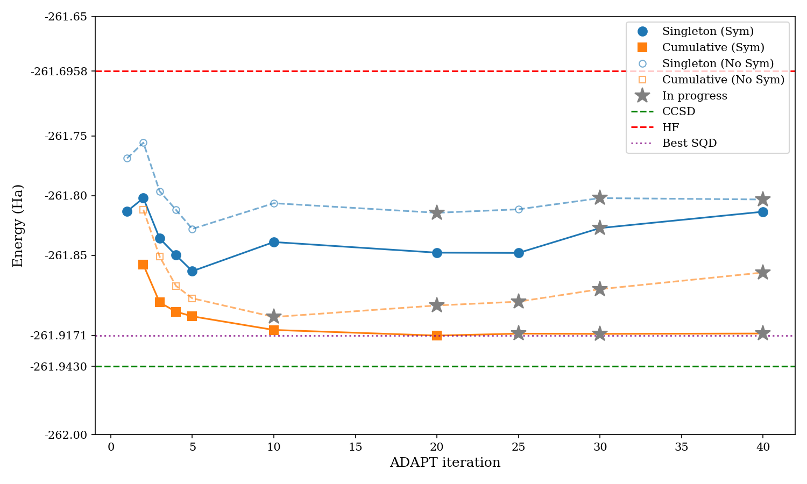
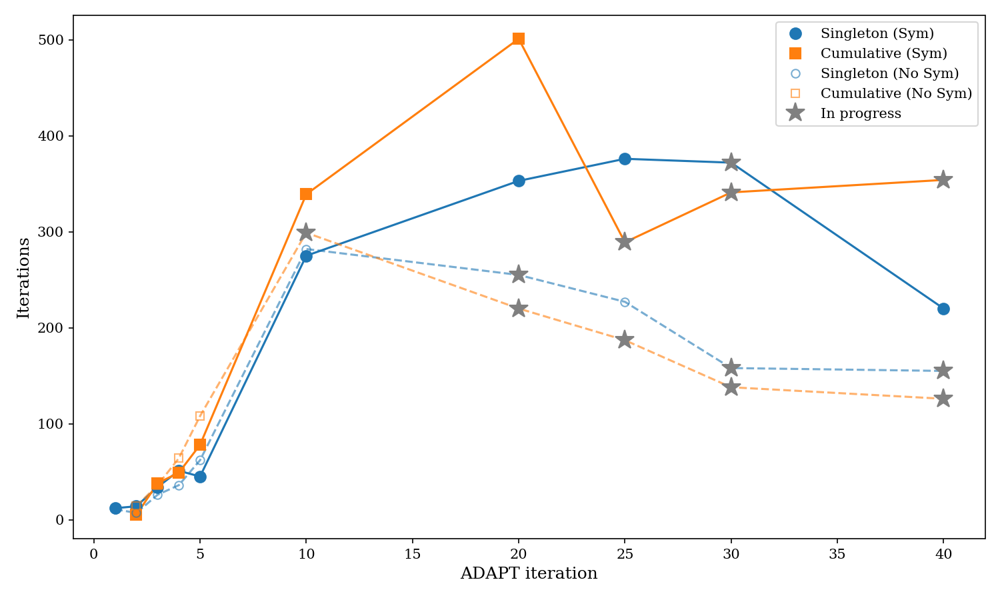
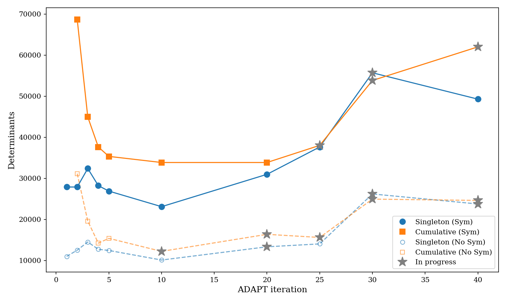

# No-Symmetrization (NoSym) Variant

## What

The standard SQD+SBD pipeline **symmetrizes** alpha and beta CI strings:
it takes the union of both spin-halves and uses that single set for both
`--adetfile` and `--bdetfile`. This means the CI space is
`|union(alpha, beta)|^2` determinants.

The **no-symmetrization** variant keeps the alpha and beta CI string sets
separate, passing them independently to SBD. The CI space is then
`|unique_alpha| x |unique_beta|` — only cross-products of strings that were
actually measured on each spin channel.

## Why

Symmetrization inflates the determinant count by including alpha-beta
combinations that were never observed in the quantum measurement data.
This variant tests whether removing those synthetic combinations:

- Reduces the CI space (and therefore wall time) without losing accuracy
- Avoids biasing the energy by including unmeasured configurations

## Results

See `../results.md` for full tables.

## Why not "nosplit"?

A natural next question: instead of splitting bitstrings into separate alpha
and beta halves at all, could we keep them as intact paired determinants
(i.e., each measured bitstring defines one specific alpha-beta pair)?

This is **not feasible** without modifying the CI solver internals:

- **PySCF** (`pyscf/fci/selected_ci.py`): `kernel_fixed_space` always forms
  the full `len(ci_strs_a) x len(ci_strs_b)` cross-product when building
  the CI Hamiltonian matrix.
- **SBD** (`include/sbdiag.h`, `MakeHelpers`): similarly constructs the full
  alpha x beta cross-product from the two determinant files.

Keeping bitstrings as paired determinants would require overhauling these CI
solver internals to only include specific (alpha_i, beta_i) pairs rather than
the full cross-product.